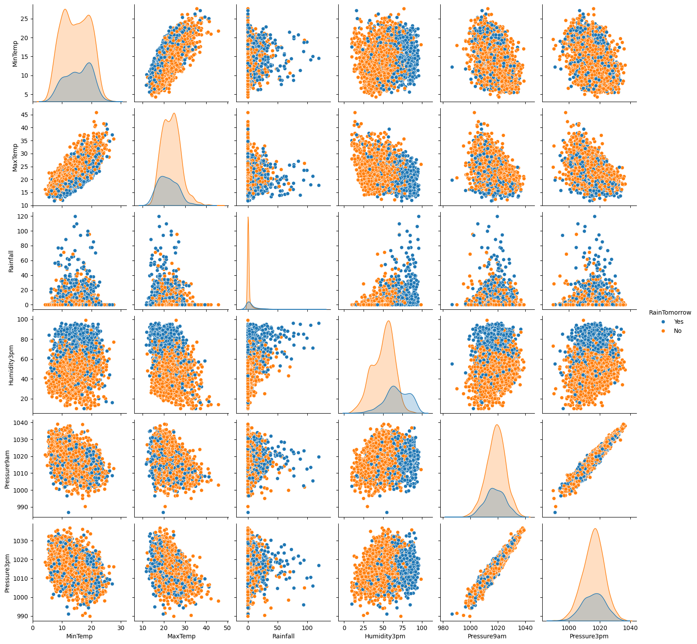
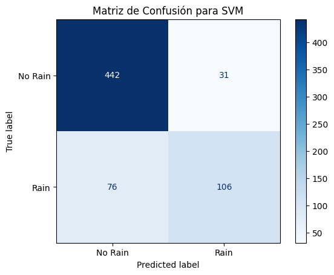
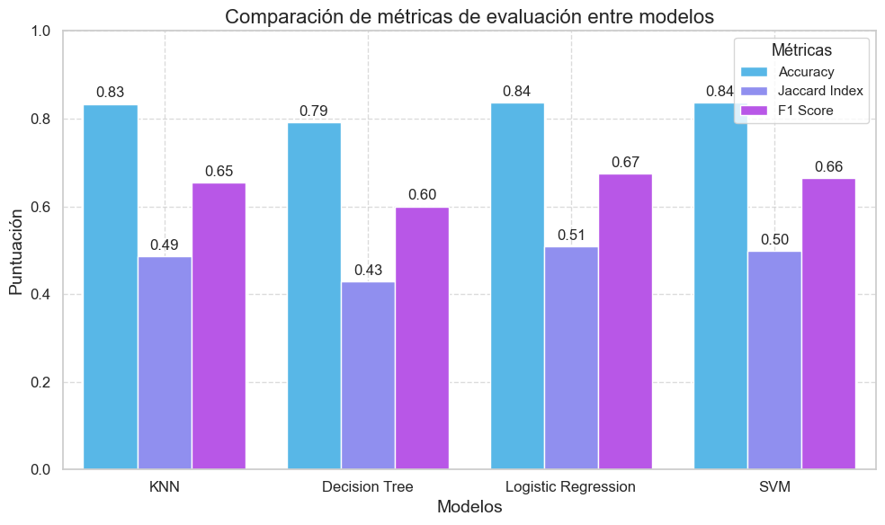

## 🛠️ Tools and Technologies Used


## 🧠 Algorithms Used

* Linear Regression	
* Ridge Regression	
* Lasso Regression	
* K-Nearest Neighbors (KNN)	
* Decision Tree	
* Support Vector Machine (SVM)	
* Grid Search with Cross-Validation (CV)	
* Hard Voting	

## 📏 Metrics Used

* Mean Absolute Error (MAE)	
* Mean Squared Error (MSE)	
* R-squared (R2)	
* Accuracy	
* Jaccard Index	
* F1 Score	
* Confusion Matrix

* * *

## 📊 Exploratory Data Analysis (EDA)

In this project, extensive exploratory data analysis was conducted to understand the relationships between different weather variables and their impact on the prediction targets. Key steps included:

### 1. **Pairplot Analysis**

A pairplot was created using Seaborn to visualize the relationships between key meteorological variables:

- Columns: `['MinTemp', 'MaxTemp', 'Rainfall', 'Humidity3pm', 'Pressure9am', 'Pressure3pm', 'RainToday', 'RainTomorrow']`



## **Data Preprocessing**

The data was preprocessed to prepare it for machine learning models. Key steps included:

- **Mapping Categorical Variables to Numeric**:
  
  ```python
  df['RainToday'] = df['RainToday'].map({'No': 0, 'Yes': 1})
  df['RainTomorrow'] = df['RainTomorrow'].map({'No': 0, 'Yes': 1})
  ```
- **Creating Dummy Variables**:
  
    ```python
  df_sydney_processed = pd.get_dummies(data=df, columns=['RainToday', 'WindGustDir', 'WindDir9am', 'WindDir3pm'])
  ```

## 🔍 Machine Learning Models and Results

### Regression Algorithms
Several regression algorithms were used to predict weather outcomes. Here are the results:

| Metric | Linear Regression | Ridge Regression |	Lasso Regression |
|--------|-------------------|------------------|------------------|
| MAE	| 0.256318 |	0.254901 |	0.254754 |
| MSE	| 0.115721 |	0.114630 |	0.114527 |
| R2	| 0.427132 |	0.432530 |	0.433039 |


### Classification Algorithms 
Various classification algorithms were tested to predict the likelihood of rain:

- **Decision Tree Classifier**:
Sample code for the Decision Tree model with hyperparameter tuning using Grid Search:

```python
from sklearn.tree import DecisionTreeClassifier
from sklearn.model_selection import GridSearchCV

tree_model = DecisionTreeClassifier()
param_grid_tree = {
    'criterion': ['gini', 'entropy'],
    'max_depth': [None, 10, 20, 30],
    'min_samples_split': [2, 5, 10]
}
grid_search_tree = GridSearchCV(estimator=tree_model, param_grid=param_grid_tree, cv=5, scoring='accuracy')
grid_search_tree.fit(X_train, y_train)
```

### Confusion Matrix for SVM:
A confusion matrix was created to visualize the performance of the Support Vector Machine (SVM) model:



| Metric	| KNN	| Decision Tree	| Logistic Regression	| SVM |
|---------|-----|---------------|---------------------|-----|
| Accuracy	| 0.833588	| 0.792366	| 0.836641	| 0.836641| 
| Jaccard Index	| 0.485849	| 0.428571	| 0.509174	| 0.497653 | 
| F1 Score	| 0.653968	| 0.600000	| 0.674772	| 0.664577 | 
| Log Loss	| NaN	| NaN	| 0.380451	| NaN | 

### Comparison of Metrics

